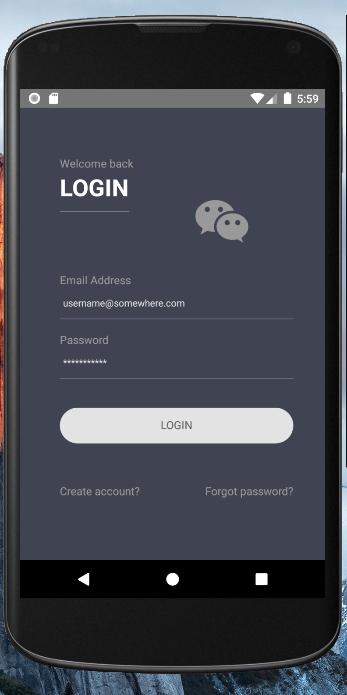
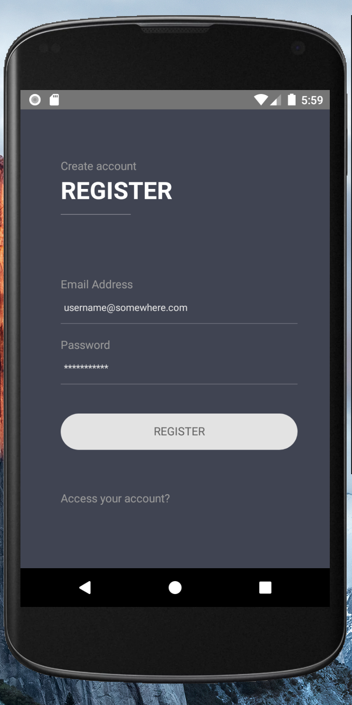
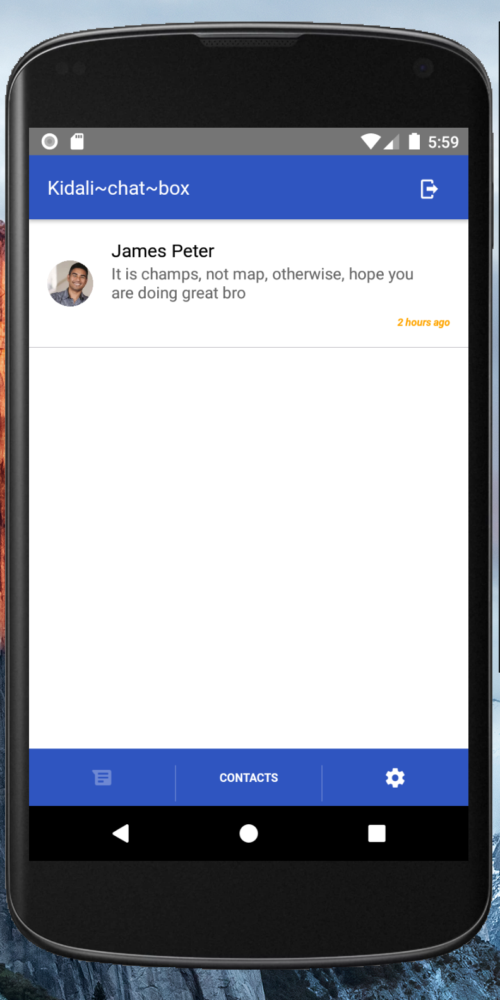
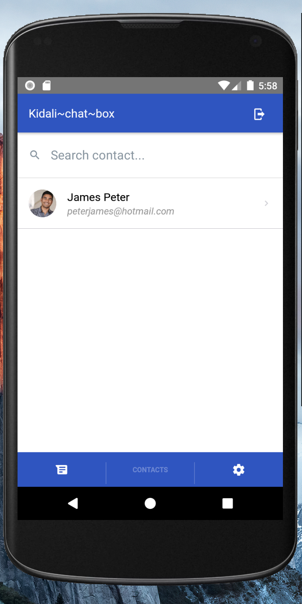
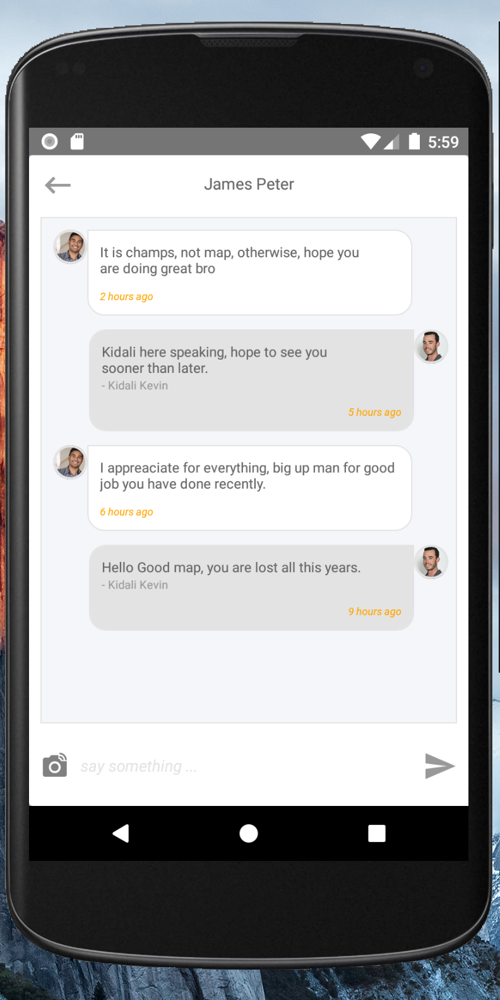
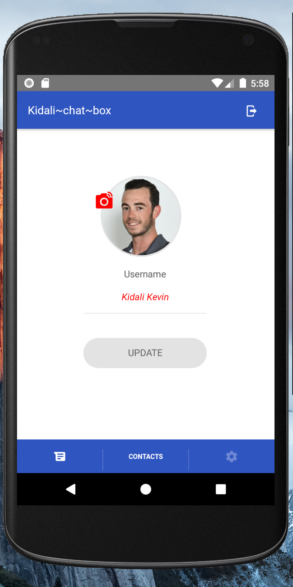

### React Native & Firebase Chat Starter Kit
- Here is a starter template done for chat integrated with firebase as a back end.
- Dont forget to generate store key for app release packaging.
- Under `android/app`, replace `google-services.json` with your own file content from google firebase.
- Replace `gradle.properties` key file-store content with your own.

- Features
<ul>
    <li>Registration</li>
    <li>Login</li>
    <li>Detect network connection</li>
    <li>View Chat Summary</li>
    <li>Profile update / Avatar image change</li>
    <li>View Registered members</li>
    <li>Real-time chat</li>
<ul>

### Installation
- Git clone the project and run `npm i` to install all the required dependecies.
- `react-native start` to start the local developement server for the project and `react-native run-android / run-ios` to ru
the project on ios or android emulator ( make sure either of the emulator is running )

### Screenshots
<b>Login View</b> 
 
<b>Registration View</b> 
 
<b>Chat Summary View</b> 

<b>Registered Members View</b> 

<b>Chatbox View</b> 

<b>Profile Update View</b> 

## Contact
- incase of any challenges: kidali.a.kevin@gmail.com